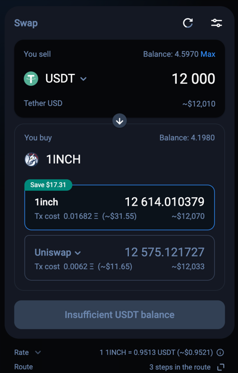

<p align="center">
  
</p>

# 1inch embedded swap widget

Library for integrating `1inch swap widget`.  
**See the live example [here](https://1inch.github.io/embedded-widget/) and the source code [here](./docs).**



## Test coverage

| Statements                  | Branches                | Functions                 | Lines             |
| --------------------------- | ----------------------- | ------------------------- | ----------------- |
|  |  |  |  |

## Installation

### Node

```
npm install @1inch/embedded-widget
```

### Yarn

```
yarn add @1inch/embedded-widget
```

---

## Usage
```typescript
import {setup1inchWidget} from '@1inch/embedded-widget';

setup1inchWidget({
    chainId: 137,
    sourceTokenSymbol: '1INCH',
    destinationTokenSymbol: 'DAI',
    hostElement: host,
    provider: window.ethereum,
    theme: 'light',
    sourceTokenAmount: '15'
});
```

## Configuration

| Option                 | Type                                                          | Example      | Description                                                                                                                                             |
|------------------------|---------------------------------------------------------------|--------------|---------------------------------------------------------------------------------------------------------------------------------------------------------|
| chainId                | `Number`                                                       | 1            | 1inch supports several chains, see the actual list on [1inch.io](https://1inch.io/)                                                                     |
| sourceTokenSymbol      | `String`                                                      | USDT         | Symbol of source token. See the full list of supported tokens on [offical 1inch docs](https://docs.1inch.io/docs/aggregation-protocol/api/swagger)      |
| destinationTokenSymbol | `String`                                                      | DAI          | Symbol of destination token. See the full list of supported tokens on [offical 1inch docs](https://docs.1inch.io/docs/aggregation-protocol/api/swagger) |
| sourceTokenAmount      | `String`                                                      | 200          | **Optional**. Using this option, you can pre-set the number of source tokens for the swap                                                                      |
| hostElement            | `HTMLElement`                                                 | document.body | The DOM element where the widget will be placed                                                                                                         |
| provider               | [EthereumProvider](./src/ethereum-iframe-json-prc-manager.ts) | window.ethereum | Provider for json-rpc requests to the wallet                                                                                                            |
| theme                  | `light / dark`                                      | light        | **Optional**. Theme of 1inch widget UI. If not set, the widget will use the system theme                                                                |

---
